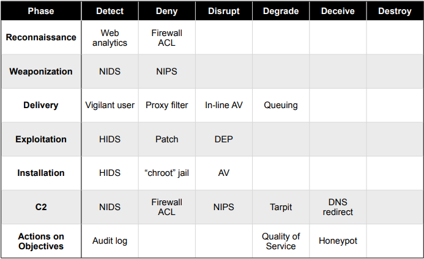
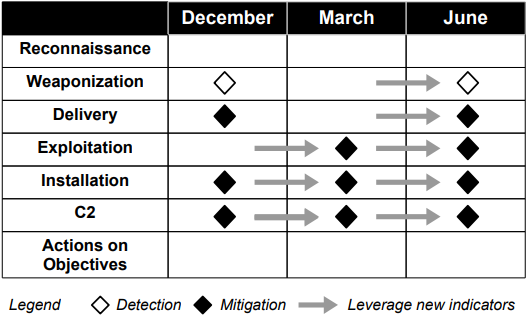
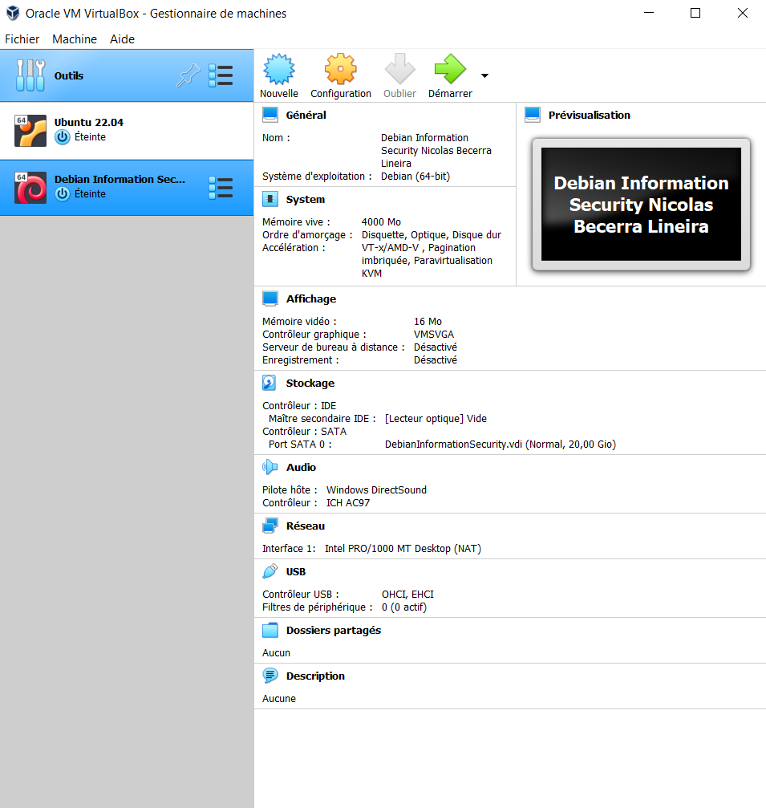
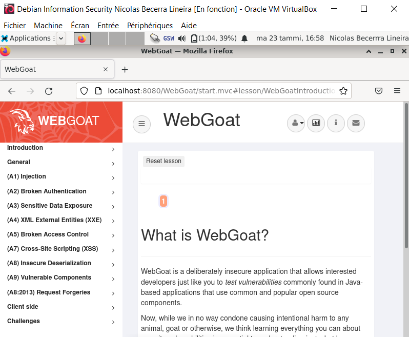
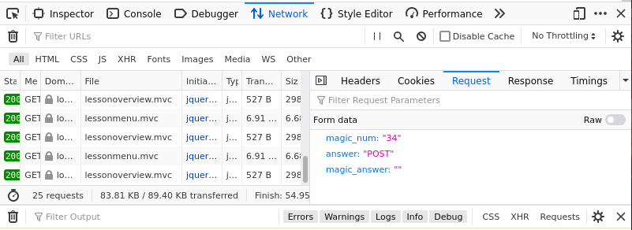
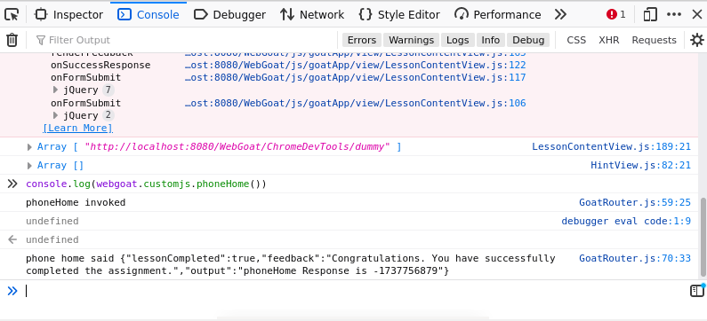
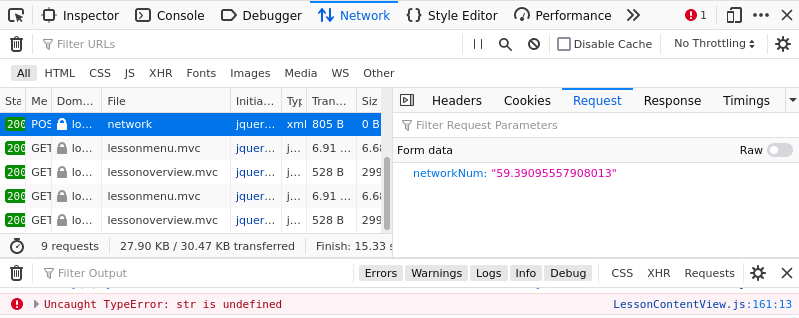

# H1 First Steps

## Abstract
* Conventional cyber defense tools (intrusion detection systems and anti-virus) focus on at-risk components, traditional intrusion methodologies and observed system 		vulnerabilities.

* Advanced Persistent Threat or APT is a new type of threat that is defined by an adversary that is more trained, better equipped and more informed about conventional   cyber defense methods. The APT threat renders conventional methods insufficient to counter the attacks launched by this adversary. This new type of adversary conducts multi-year attacks targeting economic, private or national security information.

* Cyber defense techniques have put in place a feedback loop, which will allow the collection of information about the attacks. This will allow defenders to improve     their knowledge of the opponent. This method allows to reduce the chances of success of the opponent at each attack.

*  Based on the collected information, the creation of the attack pattern named kil Chain was possible. The Kill Chain model is a model that allows to synthesize the     different phases of an intrusion, in order to prepare and anticipate the next move of the adversary and thus reduce its chances of success.

* The accelerated evolution of threats, requires an investment in network defense and especially a defense model based on intelligence as highlighted by the use of the   Kill Chain.

## 3.2 Intrusion Kill Chain
The Kill Chain is a schematic of the different states thought by the US military to target and engage an adversary, in order to create the desired effects. The Kill Chain consists of different steps: finding the potential targets of the adversary, locating them, tracking and observing them, targeting them with the appropriate means to create the desired effect, engaging the adversary and finally evaluating the effects of the operation. Illustrated as a chain to highlight that if one link fails, the whole process is interrupted.

Based on the military Kill Chain, a new Kill Chain has been developed specifically for intrusions. This chain takes as a base that an intrusion implies that the adversary must be in possession of enough power to establish a presence in a trusted environment. 

This new Kill Chain is composed of the following steps: 

* **Reconnaissance**: Search, identification and selection of targets.

* **Weaponization**: This is the act of coupling a deliverable with software to allow the adversary remote access to the environment. This is usually done using client applications such as PDF files that are used as the armed deliverable.

* **Delivery**: Transmission of the weapon to the targeted environment. This is done via email attachments, USB sticks or websites.  

* **Exploitation**:  Once the weapon is transmitted to the victim. It can target an application, an operating system vulnerability by automatically executing code or exploit users directly.

* **Installation**:  The adversary can also remain in the environment and cause no apparent damage, but simply take information. This is achieved by installing a remote access Trojan  or backdoor on the victim's system.

* **Command and Control (C2)**: A hot compormis will send a signal to a server Internet controller to establish a C2 channel. This is required to be done manually for APT type malware. As soon as the connection is established, the intruder has full control over the victim's system.

* **Action on Objectives**: It is only at this stage that the intruder can carry out his real objective. Most often, intruders seek to extract confidential information or use the victim's system as a weapon to attack another victim.

## 3.3 Courses of Action
The Intrusion kill Chain becomes an intelligence model for defenders as the enterprise's defensive capabilities are put in place to defend the resources the attacker is targeting. With this method, defenders can put in place procedures and investment plans to close the capability gap. This methodology is the foundation of intelligence-driven, allowing the defender to make decisions and take action based on intelligence and in-depth knowledge of the adversary. 

The table below illustrates a matrix with different tools to be used by the defender according to the phase of the kill chain and also for what purpose these tools are used. As for example in the exploitation phase we find the host intrusion detection systems (HIDS) which can passively detect exploit, patching denies exploitation altogether and data execution prevention. It includes traditional systems like the network intrusion detection systems (NIDS) and the firewall access control lists (ACL).

* Completeness equals resilience, which is the main goal of the defender in the face of persistent and creative attackers who continually improve their techniques.

* The "zero-day" or "day one attack" exploit is a flawed approach that does not take into account the fact that the exploit is only one change in a larger process.

* A defensive strategy of full use of indicators forces the attacker to readapt his approach to each attack. This means that the attacker's costs increase with each intrusion attempt.

* Defenders can generate metrics of this resilience by measuring the performance and effectiveness of measures taken against the adversary.

* The illustration below shows that at least one mitigation measure was implemented for three intrusion attempts. It also shows that attackers' techniques are evolving very quickly. This implies that defenders must also implement new mitigations. For example, in December the defenders managed to dig up the weaponry and block it. Unfortunately, the attackers managed to get through by evolving their technique and equipment. This shows that if the measures taken do not evolve, they become useless.

## Sources
[Hutchins et al 2011: Intelligence-Driven Computer Network Defense Informed by Analysis of Adversary Campaigns and Intrusion Kill Chains, chapters Abstract, 3.2 Intrusion Kill Chain and 3.3 Courses of Action](https://lockheedmartin.com/content/dam/lockheed-martin/rms/documents/cyber/LM-White-Paper-Intel-Driven-Defense.pdf)

---------------
## Commande Line Basics Revisited

* Time passes but the use of the command line does not disappear. It is convenient, fast, easy to automate and easily accessible. 

* Before launching yourself in the world without user interface, that of the command line. You need to know some things: 
  * This simbol "$", is the user command prompt. It is placed automatically by the system.
  * The "#" symbol is a character for placing a comment. Everything that is put after it will be ignored by the system, as it is considered as text.

### Moving and looking around

When we use the command line, we must always keep in mind that we are always in a directory. By default when opening the command line, you will be in the working directory.

> The **"pwd"** command allows you to know in which directories you are. 

    $ pwd  # it will print your localisation

> The **"ls"** command will allow you to see files and directories in the current directory.

    $ ls 
    
> The **"cd"** command allows you to change the directory. One way to remember this command is to memorize it using its full name "Change Directory".

    $ cd exampledir/ # here we will be moved to the exampledir/ directory
    
> The **"cd .."** command allows you to return to the previous directory. For example if we are currently in the exampledir/ directory, the path will be home/test/exampledir. Now if we do the command "cd .." it will take us one directory up, to the directory test/ and the path will be home/test.  Note space between command "cd" and  "..".

    $ cd ..

> The **"less"** command allows you to see a file page by page, using this commands to :
"space" shows next page, "b" shows previous page, "/" searches and "q" exits.

    $ less example.txt

> The **"ls /etc|less"** command allows you to generate an output of all commands to be read on one screen at a time by sending the output to less.

    $ ls /etc|less
    
### File Manipulation 
> **"nano"** is the easiest text editors. There is also **"pico"** as text editor.

    $ nano creatText.txt # creat a text file named creatText.txt

> The **"mkdir" command allows you to creat a new directory.$

    $ mkdir newfolder

> The **"mv"** command allows you to change the name of a directory.

    $ mv oldname newname
    
> The **"mv"** command can also use to move a directory or a file to another directory.

    $ mv somefile /newdir/
    
> The **"cp -r"** command allows you to create a copy of a file or a directory. 

    $ cp -r original copy
 
> The **"rmdir"** command allows you to remove an empty directory.

    $ rmdir emptydir
    
> The **"rm"** command allows you to remove a file.

    $ rm example # remove a fil named example
    
> The **"rm -r"** command allows you to remove a directory and its contents.

    $ rm -r exampleFolder # remove a directory named exampleFolder
    
## SSH Remote Control
> The **"ssh"** command allows you to control a machine remotely.

   $ ssh test@example.com # Here, username is test and server is example.com
   
> The **"ssh"** command allows you to disconnect to which you are connected.

    remotecomputer$ exit
    
> The **"scp -r"** command allows you to securely copy directory to a directory in remote machine.

    $ scp -r oneDirectory test@example.com:public_html/

## Help
> The **"man"** command allows you to show manual page of a command.

    $ man ls # here we want to display the manual for the "ls" command

Commands has a small builtin help.

    $ ls --help
    $ wget -h
    
### History and Guessing

> When you type a command, you can use the tab key to complete the command or display the proposals.

    $ ls /etc/re[tab]
    
> The **"history"** command allows you to display all the commands that you have run.
    
     $ history 
     
### Important directories

<table>
    <tr>
        <td>Directory</td>
        <td>Explanation</td>
    </tr>
  <tr>
        <td>/</td>
        <td>It is the root directory</td>
    </tr>
  <tr>
        <td>/home/</td>
        <td>It is constains home directories for all users</td>
    </tr>
  <tr>
        <td>/home/usertest</td>
        <td>It is the home directory for the user usertest</td>
    </tr>
  <tr>
        <td>Directory</td>
        <td>Explanation</td>
    </tr>
  <tr>
        <td>/etc/</td>
        <td>This directory contains all system wide settings</td>
    </tr>
  <tr>
        <td>/media/</td>
        <td>Automatically mounted partitions on your hard drive, as well as removable multimedia devices like CDs, digital cameras, USB sticks, etc.</td>
    </tr>
  <tr>
        <td>/var/log</td>
        <td>Directory in which all logs are stored</td>
    </tr>
</table>

### Administrative Commands

So far we have seen basic commands with a very low privilege level. In this part we will see commands that require high privileges, because they have a direct impact on the system. They allow the installation and deletion of software, the creation of users and the management of privileges. These commands because of their high level of privilege, require the command **"sudo"** before the command.

> **"sudo apt-get update"** allos you to update a list of available packages.

    $ sudo apt-get update

> **"apt-cache search"** allows you to search a software with some keywords. With this command you don't need to put **"sudo"**.

    $ apt-cache search splendor

> **"sudo apt-get -y install"** allows you to install softwares.

    $ sudo apt-get -y install

> To run an application 

    $ nethack # it will run the application named nethack
    
> **"sudo apt-get purge"** allows you to remove a software.

    $ sudo apt-get purge nethack # here we will remove the application named nethack
    
## Sources

[Karvinen 2020: Command Line Basics Revisited](https://terokarvinen.com/2020/command-line-basics-revisited/)

-----------

# Installation of Debian on VirtualBox

For the installation of the Linus Debian operating system, I followed the tutorial available on [terokarvinen.com](https://terokarvinen.com/2023/information-security-2023/#h1-first-steps).

-----

# Bandit oh-five

## Level 0
I established the ssh connection to port 2220 using the command below. The **"-p"** represents the port. 

    $ ssh bandit0@bandit.labs.overthewire.org -p 2220
    
## Level 0 -> 1
In this level I used the linux command **"ls"** to see the files available in the directory. By executing this command I found the file **"readme"**. Then I used the command "nano" followed by the name of the file to open it and find the password. However, by using the command **"cat"** we have directly a print of the content of the file which accelerates the search process.

     $ ssh bandit1@bandit.labs.overthewire.org -p 2220

## Level 1 -> 2
In this level I used the linux command **"ls"** to see the files available in the directory. By executing this command I found the file **"-"**. Then I used the command **"cat"** followed by the name of the file to open it and find the password. However, I could not see the content. So I used this command:  

    $ cat < - 

## Level 2 -> 3
In this level I had to wrap the file name in quotation marks to find the password.

    $ cat "spaces in this filename"
    
## Level 3 -> 4
In this level I used the command **"ls -a"** to display all files and directories. Then I used the command **"cd"** to go to the directory **"inhere"**. Finally, I opened the file **"hidden "** with the command **"cat"**

     $ cat .hidden
     
## Level 4 -> 5
This level required a bit more reflexion and research to find the password. To solve this level I first used the following command to access the **"inhere"** directory. 

    $ cd inhere/

Arrived in the right directory I had to find the only file readable for a human. So I had to find a file being of type **"ASCII text"**. For that I used the command **"file"** which allows to determine the type of the file which one transmits to him. Moreover, to save time and avoid making one file after the other, I used this command :

    $ file ./-file*
    
With this command we want the type of all files located in the directory starting with **"-file"**. Then, when we have found the appropriate file we just have to do the command below to find the password.

    $ cd <-file0 # I don't want to spoil ^_^

# Sources
[https://overthewire.org/](https://overthewire.org/wargames/bandit/)

-------

# Installation of WebGoat

For the installation of WebGoat, I followed the tutorial available on [terokarvinen.com](https://terokarvinen.com/2020/install-webgoat-web-pentest-practice-target/)

## Hacker warmup

### General : HTTP Basics
I managed to find the magic number by searching in the HTTP requests after putting a magic number at random.

### General : Developer tools 
I managed to do the tasks requested in chapter 4 and 6 thanks to the developer tools offered by the browser.

